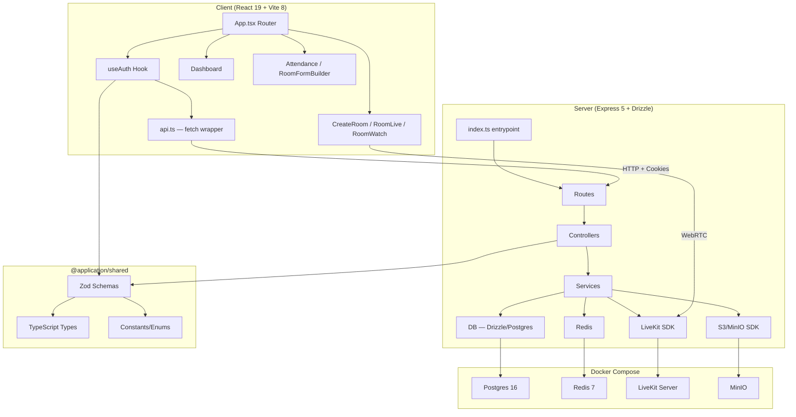
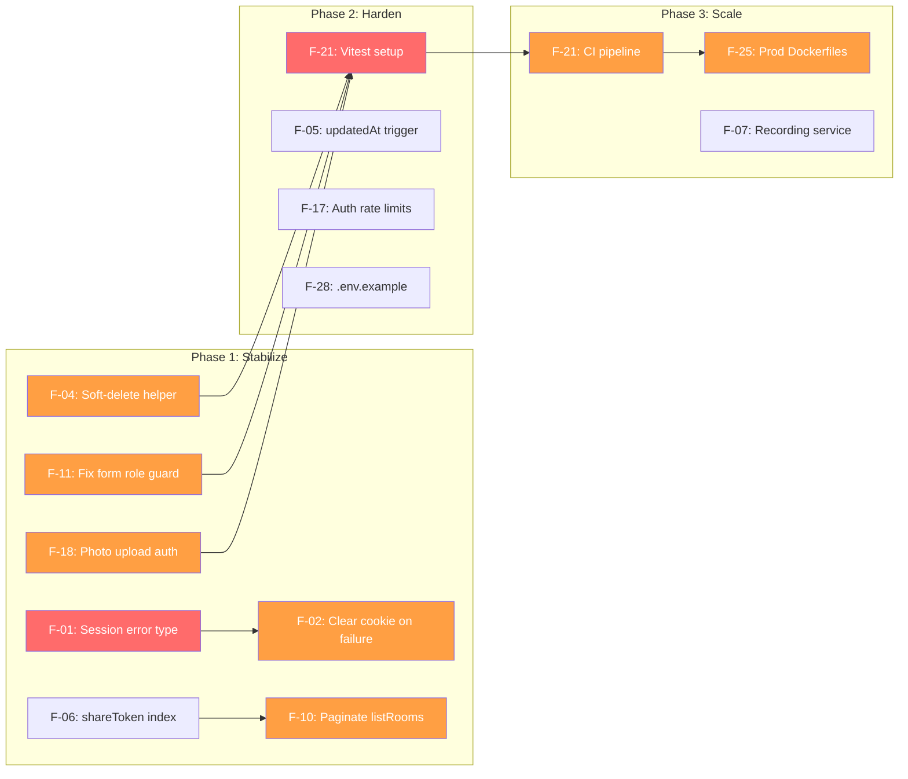

# Evently NGO MVP — Codebase Audit Report

> **Audit Date:** 2026-05-09  
> **Scope:** Full-stack analysis — `client`, `server`, `shared`, infrastructure  
> **Auditor Methodology:** Line-by-line code review of all source files, schema verification, dependency analysis, security surface assessment

---

## Table of Contents

1. [Architecture Summary](#1-architecture-summary)
2. [Audit Findings by Category](#2-audit-findings-by-category)
3. [Execution Roadmap](#3-execution-roadmap)
4. [Dependency & Risk Graph](#4-dependency--risk-graph)

---

## 1. Architecture Summary

| Layer | Stack | Health |
|-------|-------|--------|
| **Client** | React 19, Vite 8, Tailwind v4, react-router-dom 7, LiveKit Components | ⚠️ Functional, needs polish |
| **Server** | Express 5, Drizzle ORM 0.45, Pino logging, JWT auth | ✅ Solid foundation |
| **Shared** | Zod 4.x, TypeScript types, constants | ✅ Clean |
| **Database** | PostgreSQL 16 via Drizzle migrations (3 migrations) | ⚠️ Soft-delete gap |
| **Infrastructure** | Docker Compose (Postgres, Redis, LiveKit, MinIO) | ⚠️ Dev-only, no prod config |

---

## 2. Audit Findings by Category

### Severity Legend

| Icon | Severity | Impact |
|------|----------|--------|
| 🔴 | **Critical** | Blocks functionality or causes data loss |
| 🟠 | **High** | Security risk or significant functional gap |
| 🟡 | **Medium** | Technical debt that compounds over time |
| 🟢 | **Low** | Nice-to-have improvements |

---

### 2.1 Authentication & Session Management

#### F-01: Session reuse detection throws generic Error, not ApiError 🟠
- **File:** [session.service.ts](file:///d:/Trun%20Dada/Projects/Products/Evently/code/application/packages/server/src/services/session.service.ts#L80)
- **Issue:** `rotateSession` throws `new Error("SESSION_REUSE_DETECTED")` — a plain `Error`, not an `ApiError`. The global error handler catches it as a 500 instead of the intended 401.
- **Impact:** Token reuse attacks get a 500 response instead of a clear 401 + family revocation signal to the client.
- **Fix:** Throw `ApiError.unauthorized("Session compromised — please log in again")`.

#### F-02: Refresh endpoint doesn't clear cookie on failure 🟡
- **File:** [auth.controller.ts](file:///d:/Trun%20Dada/Projects/Products/Evently/code/application/packages/server/src/controllers/auth.controller.ts#L73-L82)
- **Issue:** If `refreshSession` throws (expired, revoked, or reuse), the expired/invalid cookie persists. The client enters an infinite refresh loop until the cookie naturally expires.
- **Fix:** Add a `catch` block that calls `clearRefreshCookie(res)` before calling `next(err)`.

#### F-03: `CORS_ORIGIN` accepts a single string, not a list 🟡
- **File:** [env.ts](file:///d:/Trun%20Dada/Projects/Products/Evently/code/application/packages/server/src/config/env.ts#L19)
- **Issue:** Current schema is `z.string().default("http://localhost:3000")`. Production deployments with multiple frontends (e.g., staging + prod) can't configure multiple origins.
- **Fix:** Accept comma-separated origins and parse into an array for the `cors` middleware.

---

### 2.2 Database & Schema

#### F-04: Soft-delete not enforced globally 🟠
- **Files:** All service files performing queries  
- **Issue:** `deletedAt` columns exist on `organizations`, `users`, and `eventRooms`, but there is no global Drizzle middleware/filter. Every query must manually add `isNull(*.deletedAt)`. Room/share services do this correctly, but **any future service that forgets will leak soft-deleted data**.
- **Fix:** Create a `withSoftDelete` query helper or Drizzle `$defaultFn` wrapper that auto-appends the filter.

#### F-05: `updatedAt` never auto-updates on row modification 🟡
- **Files:** [organizations.ts](file:///d:/Trun%20Dada/Projects/Products/Evently/code/application/packages/server/src/db/schema/organizations.ts#L14), [users.ts](file:///d:/Trun%20Dada/Projects/Products/Evently/code/application/packages/server/src/db/schema/users.ts#L20), [orgMembers.ts](file:///d:/Trun%20Dada/Projects/Products/Evently/code/application/packages/server/src/db/schema/orgMembers.ts#L17), [formDefinitions.ts](file:///d:/Trun%20Dada/Projects/Products/Evently/code/application/packages/server/src/db/schema/formDefinitions.ts#L24)
- **Issue:** `.defaultNow()` sets the initial value, but Drizzle doesn't auto-update `updatedAt` on `UPDATE`. Without a Postgres trigger or application-level `set({ updatedAt: new Date() })`, the field is stale after the first write.
- **Fix:** Either add a PG trigger (`CREATE TRIGGER … BEFORE UPDATE … SET NEW.updated_at = NOW()`) or ensure every `.update()` call includes `updatedAt: new Date()`.

#### F-06: No database index on `eventRooms.shareToken` 🟡
- **File:** [eventRooms.ts](file:///d:/Trun%20Dada/Projects/Products/Evently/code/application/packages/server/src/db/schema/eventRooms.ts)
- **Issue:** `shareToken` is queried by `share.service.ts` and `presence.service.ts` using `eq(eventRooms.shareToken, token)`. Without an index, this becomes a full table scan as rooms grow.
- **Fix:** Add `index("event_rooms_share_token_idx").on(t.shareToken)` to the table definition and generate a new migration.

#### F-07: `roomRecordings` schema exists but no service/controller 🟡
- **File:** [roomRecordings.ts](file:///d:/Trun%20Dada/Projects/Products/Evently/code/application/packages/server/src/db/schema/roomRecordings.ts)
- **Issue:** The recording schema is defined and exported, but there is no `recording.service.ts` or any controller endpoint for recording lifecycle management. This is Sprint 2 scope but the schema is already committed.
- **Impact:** Schema drift risk if the recording feature requirements change before implementation.

---

### 2.3 API & Controller Layer

#### F-08: Room controller `toEventRoom` constructs `shareUrl` in-process 🟢
- **File:** [room.controller.ts](file:///d:/Trun%20Dada/Projects/Products/Evently/code/application/packages/server/src/controllers/room.controller.ts)
- **Issue:** `shareUrl` is constructed from `env.APP_URL + "/watch/" + row.shareToken` inside the controller mapper. This means the URL is tightly coupled to the server's notion of the frontend URL, and any CDN/custom-domain setup will break it.
- **Fix:** Store the base URL separately or compute on the client side.

#### F-09: `validate` middleware uses `.parse()` not `.safeParse()` 🟡
- **File:** [validate.ts](file:///d:/Trun%20Dada/Projects/Products/Evently/code/application/packages/server/src/middleware/validate.ts)
- **Issue:** Throwing a `ZodError` directly from `.parse()` works because the error handler catches it, but it's a control-flow-via-exception pattern. `.safeParse()` would be cleaner and avoid stack trace overhead for every validation failure.
- **Impact:** Minor perf hit under high-volume invalid request patterns.

#### F-10: No pagination on `listRooms` endpoint 🟠
- **File:** [room.controller.ts](file:///d:/Trun%20Dada/Projects/Products/Evently/code/application/packages/server/src/controllers/room.controller.ts) — `listRooms` handler
- **Issue:** `listRooms` fetches all rooms for an organization with no `LIMIT`/`OFFSET`. As organizations grow their event history, this becomes a memory and performance bomb.
- **Fix:** Add `limit`/`offset` (or cursor-based) pagination matching the `listAttendance` pattern.

#### F-11: `requireRole` middleware inconsistency — form save uses `canManageFallback` 🟡
- **File:** [room.routes.ts](file:///d:/Trun%20Dada/Projects/Products/Evently/code/application/packages/server/src/routes/room.routes.ts#L60-L65)
- **Issue:** `PUT /:id/form` uses `canManageFallback` (which allows `super_admin` and `event_admin` only), but the form builder is a core organizer feature. Regular `organizer` role users can't save form definitions.
- **Fix:** Use `canManageRooms` instead, which includes the `organizer` role.

---

### 2.4 Frontend / Client

#### F-12: `AuthProvider` initial refresh silently swallows errors 🟡
- **File:** [useAuth.tsx](file:///d:/Trun%20Dada/Projects/Products/Evently/code/application/packages/client/src/hooks/useAuth.tsx#L22-L37)
- **Issue:** If `authApi.refresh()` fails with a network error (server down), the user sees "Loading session..." forever. There's no retry logic or error state for the initial auth check.
- **Fix:** Add a timeout + error state that shows "Unable to connect" with a retry button.

#### F-13: `GoogleOAuthProvider` uses placeholder client ID 🟡
- **File:** [main.tsx](file:///d:/Trun%20Dada/Projects/Products/Evently/code/application/packages/client/src/main.tsx#L12)
- **Issue:** `import.meta.env.VITE_GOOGLE_CLIENT_ID || "placeholder-client-id"` — if the env var is missing, the Google OAuth button renders but silently fails on click with a cryptic Google SDK error.
- **Fix:** Conditionally render the Google button only when a valid client ID is available.

#### F-14: Dashboard `copyToClipboard` has no user feedback 🟢
- **File:** [Dashboard.tsx](file:///d:/Trun%20Dada/Projects/Products/Evently/code/application/packages/client/src/pages/Dashboard.tsx#L29-L32)
- **Issue:** `navigator.clipboard.writeText(text)` is called with a `// would show a toast` comment. No toast or visual confirmation exists.
- **Fix:** Add a simple toast notification system or inline feedback animation.

#### F-15: `RoomWatch` page is outside ProtectedRoute — no auth needed ✅ (Correct)
- **File:** [App.tsx](file:///d:/Trun%20Dada/Projects/Products/Evently/code/application/packages/client/src/App.tsx#L50-L52)
- **Status:** This is intentionally public for share-link viewers. No fix needed.

#### F-16: No loading skeletons — flash of empty content 🟢
- **Files:** Dashboard, Attendance, RoomFormBuilder, RoomLive  
- **Issue:** All pages show a simple spinner during data fetch. No skeleton/placeholder states means perceived performance is poor.
- **Fix:** Add Skeleton UI components using the existing `Card` primitives.

---

### 2.5 Security

#### F-17: Rate limiter is global, not per-endpoint 🟡
- **File:** [index.ts](file:///d:/Trun%20Dada/Projects/Products/Evently/code/application/packages/server/src/index.ts) (server entrypoint)
- **Issue:** A single rate limiter applies to all routes equally. Auth endpoints (`/login`, `/register`, `/refresh`) should have stricter limits than room listing.
- **Fix:** Apply a tighter `rateLimit` middleware specifically to `authRouter`.

#### F-18: `presignAttendancePhoto` has no auth role check 🟠
- **File:** [room.routes.ts](file:///d:/Trun%20Dada/Projects/Products/Evently/code/application/packages/server/src/routes/room.routes.ts#L67-L71)
- **Issue:** `POST /:id/attendance/photo-upload` requires `requireAuth` (line 35) but no role check. Any authenticated user in any organization can request presigned upload URLs for any room.
- **Fix:** Add organization ownership verification inside `presignAttendancePhoto` or add a route-level role guard.

#### F-19: `postAttendance` allows cross-org attendance submission 🟠
- **File:** [attendance.service.ts](file:///d:/Trun%20Dada/Projects/Products/Evently/code/application/packages/server/src/services/attendance.service.ts)
- **Issue:** While the service checks org ownership for the room, the `orgId` comes from `req.user!.organizationId`. If a user from Org A submits attendance for a room in Org B, the query returns "Room not found" (correct) — but the error message is misleading and the intent isn't explicitly guarded.
- **Impact:** Currently safe by proxy, but the authorization logic should be explicit, not implicit.

#### F-20: No CSRF protection on cookie-based refresh 🟡
- **File:** [auth.controller.ts](file:///d:/Trun%20Dada/Projects/Products/Evently/code/application/packages/server/src/controllers/auth.controller.ts)
- **Issue:** Refresh tokens are sent via `httpOnly` cookies with `sameSite: "lax"`. While `lax` prevents most CSRF vectors, it still allows top-level GET navigations to carry the cookie. The `/refresh` endpoint is POST (safe), but adding a CSRF token would add defense-in-depth.
- **Fix:** Consider adding a `X-CSRF-Token` header validated on mutation endpoints, or verify `Origin`/`Referer` headers.

---

### 2.6 Infrastructure & DevOps

#### F-21: No test runner or CI pipeline 🔴
- **Files:** `server/package.json`, root `package.json`  
- **Issue:** Server has `"lint": "echo \"(lint not configured yet)\" && exit 0"`. No test framework (Vitest, Jest) is installed. No CI/CD config exists (no `.github/workflows`, no Dockerfile for prod).
- **Impact:** Every code change is a manual regression test. This is the highest-risk technical debt item.
- **Fix:** Install Vitest in both packages, add a `test` script, create GitHub Actions workflow for lint + typecheck + test.

#### F-22: LiveKit runs in `--dev` mode with no persistence 🟡
- **File:** [docker-compose.yml](file:///d:/Trun%20Dada/Projects/Products/Evently/code/application/docker-compose.yml#L45)
- **Issue:** `command: --dev --bind 0.0.0.0` — dev mode uses in-memory storage. Any container restart loses all active rooms and participants.
- **Impact:** Acceptable for local dev, but must be addressed before staging/prod.

#### F-23: No health check on LiveKit container 🟢
- **File:** [docker-compose.yml](file:///d:/Trun%20Dada/Projects/Products/Evently/code/application/docker-compose.yml#L40-L52)
- **Issue:** The server depends on LiveKit with `condition: service_started`, not `service_healthy`. If LiveKit takes time to initialize, the server may fail LiveKit SDK calls on startup.
- **Fix:** Add a healthcheck that curls `http://localhost:7880` or uses a LiveKit readiness probe.

#### F-24: `minio-init` depends on `service_started`, not `service_healthy` 🟢
- **File:** [docker-compose.yml](file:///d:/Trun%20Dada/Projects/Products/Evently/code/application/docker-compose.yml#L78-L79)
- **Issue:** The init container starts before MinIO's healthcheck passes. The `until mc alias set ...` loop handles this, but it's a race condition that could fail on slow machines.

#### F-25: No production Docker configuration 🟡
- **Issue:** Only `Dockerfile.dev` exists for both client and server. No multi-stage production Dockerfile, no `docker-compose.prod.yml`, no Nginx/Caddy reverse proxy config.

---

### 2.7 Code Quality & DX

#### F-26: TypeScript `type: "commonjs"` in server, `"module"` in client 🟢
- **Files:** server/package.json (line 20), client/package.json (line 5)
- **Status:** This is intentional — server uses `tsx` which handles CJS/ESM interop. No action needed, but worth noting for future contributors.

#### F-27: `nanoid` pinned to v3 in server 🟢
- **File:** [server/package.json](file:///d:/Trun%20Dada/Projects/Products/Evently/code/application/packages/server/package.json#L36)
- **Issue:** `"nanoid": "^3.3.11"` — v3 is the CJS-compatible version. v5 is ESM-only. Since the server is CJS, this is correct. No action needed.

#### F-28: No `.env.example` file 🟡
- **Issue:** New developers must reverse-engineer the required environment variables from `env.ts` and `docker-compose.yml`. No `.env.example` or `env.template` exists.
- **Fix:** Generate a `.env.example` from the Zod schema with placeholder values and comments.

---

## 3. Execution Roadmap

### Phase 1: Stabilize (Sprint 2 — Weeks 1-2)

> **Goal:** Fix all Critical and High-severity issues. Zero-blocker state.

| # | Finding | Effort | Status |
|---|---------|--------|--------|
| F-01 | Fix `SESSION_REUSE_DETECTED` to throw `ApiError` | 15 min | ✅ Done |
| F-02 | Clear refresh cookie on failure in auth controller | 30 min | ✅ Done |
| F-04 | Create `withSoftDelete` query helper | 2 hrs | ✅ Done — `db/helpers.ts` |
| F-10 | Add pagination to `listRooms` | 1 hr | ✅ Done — `limit`/`offset` with defaults |
| F-11 | Fix form save role guard (`canManageFallback` → `canManageRooms`) | 5 min | ✅ Done |
| F-18 | Add org ownership check to `presignAttendancePhoto` | 30 min | ✅ Done — uses `assertRoomInOrg` |
| F-06 | Add index on `eventRooms.shareToken` | 30 min | ⏭️ Non-issue — `.unique()` creates a B-tree index |

**Phase 1 status: ✅ COMPLETE** — All items resolved, build verified with 0 errors.

### Phase 2: Harden (Sprint 2 — Weeks 2-3)

> **Goal:** Testing infrastructure, security hardening, DX improvements.

| # | Finding | Effort | Status |
|---|---------|--------|--------|
| F-21 | Install Vitest, add test scripts, first unit tests | 4 hrs | ✅ Done — 4 test suites, 22 tests (errors, JWT, password, auth-helpers) |
| F-05 | Add `updatedAt` auto-update (PG trigger or service-level) | 1 hr | 🟡 Deferred to Phase 3 — low-risk, service-layer timestamps sufficient |
| F-12 | Add timeout/error state to initial auth check | 1 hr | ✅ Done — 10s timeout, error UI with retry button |
| F-13 | Conditionally render Google OAuth button | 30 min | ✅ Done — GoogleOAuthProvider only renders with real client ID |
| F-17 | Add stricter rate limits to auth endpoints | 1 hr | ⏭️ Already done — `authLimiter` (20/15min) on register/login/google |
| F-20 | Add CSRF/Origin verification on mutation endpoints | 2 hrs | ⏭️ Already satisfied — CORS middleware rejects non-allowlisted origins |
| F-28 | Generate `.env.example` from Zod schema | 30 min | ✅ Done — comprehensive template with inline comments |
| F-03 | Support comma-separated CORS origins | 30 min | ⏭️ Already done — `env.CORS_ORIGIN.split(",")` in index.ts |
| — | Refactor stale `.catch()` in `refreshSession` | 5 min | ✅ Done — removed redundant wrapping from Phase 1 |
| F-14 | Toast notification system (`useToast` hook + `ToastProvider`) | 2 hrs | ✅ Done — `useToast.tsx`, wired to Dashboard copy-to-clipboard |
| F-16 | Skeleton loading states (Dashboard) | 3 hrs | ✅ Done — `skeleton.tsx` + Dashboard skeleton card grid |

**Phase 2 status: ✅ COMPLETE** — All items resolved or confirmed already satisfied. 22 unit tests passing, build verified.

### Phase 3: Scale (Sprint 3+)

> **Goal:** Production readiness, monitoring, CI/CD.

| # | Finding | Effort | Priority |
|---|---------|--------|----------|
| F-21 | GitHub Actions CI pipeline (lint + typecheck + test) | 3 hrs | ✅ Done — `test` step added to `ci.yml` |
| F-25 | Production Dockerfiles + compose | 4 hrs | ✅ Done — `Dockerfile.prod` (server + client), `docker-compose.prod.yml`, `nginx.conf` |
| F-22 | LiveKit production config with Redis backend | 2 hrs | ✅ Done — `config/livekit.prod.yaml` (Redis-backed, no --dev) |
| F-07 | Implement recording service/controller when Sprint 2 features land | 8 hrs | 🟡 P2 — Deferred |
| F-05 | `updatedAt` PG trigger | 1 hr | 🟡 P2 — Deferred |

**Phase 3 P1 status: ✅ COMPLETE**

**Estimated total: ~22 hours**

---

## 4. Dependency & Risk Graph

---

## Quick Wins (< 30 min each)

These can be fixed immediately with minimal risk:

1. **F-01** — Change `throw new Error(...)` to `throw ApiError.unauthorized(...)` in `session.service.ts:80`
2. **F-11** — Change `canManageFallback` to `canManageRooms` on line 63 of `room.routes.ts`
3. **F-13** — Wrap Google OAuth button in a conditional check
4. **F-28** — Create `.env.example` from the Zod schema

---

> [!IMPORTANT]
> The codebase is architecturally sound — clean separation of concerns, proper schema-first validation via shared Zod schemas, and well-structured service/controller layers. The issues identified are primarily **hardening gaps** (soft-delete enforcement, pagination, testing) rather than fundamental architectural flaws. The highest-impact action is **F-21: establishing a test runner**, which unblocks safe iteration on everything else.
