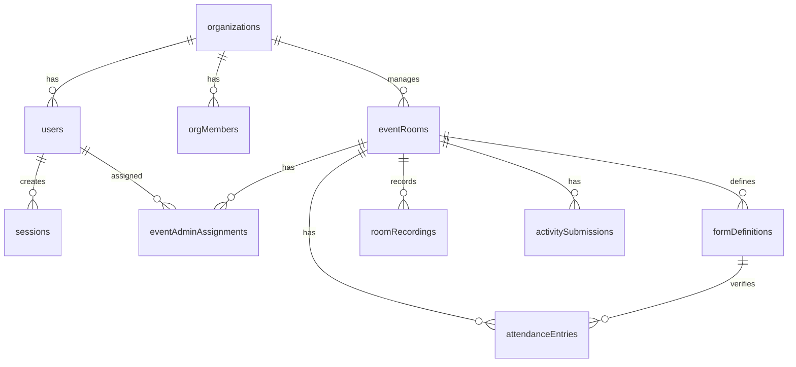

# Project Context: Eventclick (Eventclick)

Eventclick (Eventclick) is a real-time NGO transparency and verification platform. It allows non-profit organizations to demonstrate active fieldwork and operational accountability to donors and funders by hosting live-streamed event rooms, sharing secure live-view links, and capturing time-bound attendance verification records with photo evidence.

---

## 🚀 Tech Stack

### Monorepo Setup

- **Workspaces**: `packages/client`, `packages/server`, `packages/shared`
- **Orchestration**: Turborepo + npm Workspaces

### Frontend (`packages/client`)

- **Core**: React 19 + Vite + TypeScript
- **Styling**: Tailwind CSS v4 (`@tailwindcss/vite`)
- **Routing**: `react-router-dom` v7 (web app framework)
- **Networking**: Custom fetch wrapper (`src/lib/api.ts`) with automated token refresh and deduplicated request queuing.
- **Media & Capture**: Browser MediaDevices API (`getUserMedia` / Canvas) with aspect-correct frame snapping, real-time client-side JPEG compression, and drag-and-drop uploads.

### Backend (`packages/server`)

- **Server**: Express 5 + TypeScript
- **Database ORM**: Drizzle ORM
- **Database Driver**: `pg` (PostgreSQL)
- **In-Memory Store**: Redis (rate limiting, presence, locking)
- **Storage Integrations**: AWS S3/S3-compatible storage with time-bound secure signed PUT / GET URL generation.
- **Validation**: Zod (process config environment validation on startup)
- **Logging**: Pino / `pino-http`

### Shared Library (`packages/shared`)

- **Role**: Shared models, types, helper functions, and Zod validator schemas.
- **Consumption**: Loaded directly as TypeScript source from `packages/shared/src/index.ts` without a compilation/build step.

---

## 📁 Repository Directory Layout

```
.
├── .github/workflows/   # CI/CD Workflows (CI pipeline with lint, typecheck, build)
├── packages/
│   ├── client/          # React 19 Frontend
│   │   ├── src/
│   │   │   ├── components/   # Reusable UI component blocks & layouts
│   │   │   ├── hooks/        # React Hooks (auth context, presence, etc.)
│   │   │   ├── lib/          # api.ts (fetch client & activitiesApi)
│   │   │   └── pages/        # Dashboard, Live (w/ Activity Panel), Watch, Auth, Create Room, etc.
│   │   └── package.json
│   ├── server/          # Express 5 Backend
│   │   ├── src/
│   │   │   ├── config/       # Env validation and configs
│   │   │   ├── controllers/  # controllers (room, activity, user, etc.)
│   │   │   ├── db/           # Drizzle schema definitions (schema/activitySubmissions.ts)
│   │   │   ├── middleware/   # Validation, Auth guards, Error handling
│   │   │   ├── routes/       # routes (room.routes.ts w/ activity routes)
│   │   │   └── services/     # services (activity.service.ts, storage.service.ts)
│   │   └── package.json
│   └── shared/          # Shared validators, types, and constants
│       ├── src/
│       │   └── index.ts      # Shared Zod validation contracts (ActivityDefinitionSchema, etc.)
│       └── package.json
├── package.json
├── turbo.json
└── CLAUDE.md            # Quick CLI & dev command guidelines
```

---

## 🗄️ Database Schema & Relationships

Implemented via Drizzle ORM under `packages/server/src/db/schema/`.



### Table Definitions Reference

1. **`organizations`**
   - Core tenant identifier. Representing the NGO/Non-profit.
   - Keys: `id` (UUID PK), `slug` (unique), `name`, `isActive`, `createdAt`, `updatedAt`, `deletedAt` (soft delete).

2. **`users`**
   - Application users (admins, event coordinators, volunteers).
   - Keys: `id` (UUID PK), `email` (unique), `passwordHash`, `fullName`, `role` (`userRoleEnum`), `organizationId` (FK -> `organizations.id`), `googleId`, `isActive`, `emailVerifiedAt`, `createdAt`, `updatedAt`, `deletedAt` (soft delete).

3. **`orgMembers`**
   - Mapping between user and organization (with specific workspace role assignment).
   - Keys: `id` (UUID PK), `organizationId` (FK), `userId` (FK), `role`, `isActive`, `joinedAt`, `createdAt`, `updatedAt`.

4. **`eventRooms`**
   - Individual streaming / attendance rooms. Contains **Quality-Control activity definitions** as flat templates.
   - Keys: `id` (UUID PK), `organizationId` (FK), `createdBy` (FK -> `users.id`), `title`, `description`, `status` (`scheduled`, `live`, `ended`, `cancelled`), `scheduledStart`, `scheduledEnd`, `actualStart`, `actualEnd`, `maxParticipants`, `shareToken`, `shareUrl`, `streamProvider` (`livekit`, `youtube`), `youtubeWatchUrl`, `youtubeEmbedUrl`, `attendanceWindowBefore` (mins), `attendanceWindowAfter` (mins), `activityDefinitions` (JSONB array containing tasks & proof targets), `createdAt`, `updatedAt`, `deletedAt`.

5. **`sessions`**
   - Opaque refresh token sessions supporting rotation.
   - Keys: `id` (UUID PK), `userId` (FK -> `users.id`), `tokenFamily` (UUID for session tracking), `tokenHash` (SHA-256), `expiresAt`, `isRevoked`, `createdAt`, `updatedAt`.

6. **`formDefinitions`**
   - Dynamic custom fields used to build localized attendance check forms.
   - Keys: `id` (UUID PK), `roomId` (FK -> `eventRooms.id`), `version` (int), `fields` (JSONB mapping schema fields), `createdAt`, `updatedAt`.

7. **`attendanceEntries`**
   - User-submitted dynamic forms serving as verification records.
   - Keys: `id` (UUID PK), `roomId` (FK -> `eventRooms.id`), `formDefinitionId` (FK -> `formDefinitions.id`), `data` (JSONB values matching the dynamic schema), `photoUrl` (S3/Cloud storage public URL serving as photographic proof), `submittedAt`.

8. **`roomRecordings`**
   - Metadata for recorded room live streams.
   - Keys: `id` (UUID PK), `roomId` (FK -> `eventRooms.id`), `status` (`pending`, `active`, `completed`, `failed`), `egressId` (LiveKit egress mapping), `s3Key`, `mimeType`, `sizeBytes`, `publicUrl`, `startedAt`, `endedAt`, `createdAt`.

9. **`eventAdminAssignments`**
   - Delegation map granting specific coordinators or volunteers administrative access over rooms.
   - Keys: `id` (UUID PK), `organizationId` (FK), `userId` (FK), `roomId` (FK), `assignedRole`, `assignedBy`, `createdAt`, `updatedAt`, `revokedAt`.

10. **`activitySubmissions`**
    - Stores verification progress and S3 photo proof references for room QC tasks.
    - Keys: `id` (UUID PK), `roomId` (FK -> `eventRooms.id`), `activityId` (VARCHAR PK-join), `photos` (JSONB array containing photo key details and signed viewer URLs), `createdAt`, `updatedAt`.

---

## 🔑 Key Architecture & System Workflows

### 1. Dual-Token Authentication Model

- **Access Token**: Short-lived JWT (`JWT_ACCESS_TTL`, default 15m), stored in memory on the client side. Received in payload on login/refresh.
- **Refresh Token**: Long-lived random opaque token (`Eventclick_rt` cookie, httpOnly, secure, path scoped to `/api/v1/auth`, `JWT_REFRESH_TTL`, default 7d). Only its SHA-256 hash is saved in `sessions`.
- **Token Rotation & Security**:
  - Token exchange uses single-use rotation. A new pair is generated and the old one is flagged as invalid.
  - If an expired/already-used refresh token is presented, a **replay attack is suspected**. The backend immediately revokes the entire `tokenFamily` lineage, invalidating all associated access and forcing a complete re-login.

### 2. Permissions Model

Shared role system mapped in `@application/shared`:

- **Roles**: `ngo_admin`, `event_admin`, `volunteer`.
- **NGO Admin**: Full control over organizations, user creation, room building, live sessions, reporting, and assignments.
- **Event Admin**: Create volunteers, build custom forms, start live streams, trigger recordings, view room assignments, and capture reports.
- **Volunteer**: Live viewing, room link sharing, taking attendance submissions.

### 3. Real-Time Room & Streaming Flow

- **Primary Streaming Provider**: LiveKit (real-time low latency WebRTC). Emits JSON Web Tokens for client publisher/viewer join credentials.
- **Backup Provider**: YouTube Live stream URLs. Parsed on backend and embedded as iframe viewing fallbacks (`youtubeWatchUrl` -> `youtubeEmbedUrl`).
- **Presence Tracking**: Active connections tracked using Redis sorted sets, allowing real-time participant metrics per room.

### 4. Dynamic Verification (Attendance Forms)

- **Form Builder**: NGO Admins or Event Admins design custom forms inside `RoomFormBuilder.tsx` supporting standard input types (`text`, `email`, `phone`, `number`, `select`, `checkbox`, `date`).
- **Storage**: Schema definitions stored as JSONB array configurations inside `formDefinitions`.
- **Validation**: Submissions are strictly verified against the matching JSONB schema.
- **Photo Capture**: Incorporates visual verification. Presigned S3/S3-compatible URLs are requested via `/api/v1/rooms/:id/attendance/upload-url`, uploaded directly via client, and the key is submitted with dynamic form values.

### 5. Quality-Control (QC) Activity Tracking

- **Checklist Definitions**: NGO Admins set a mandatory checklist of activities per room during creation. Mapped inside `event_rooms.activity_definitions` as a flat JSONB schema array (`title`, `description`, `min_photos`).
- **Submission Normalization**: Activity submissions are relationally stored in `activity_submissions` mapping to `roomId` and `activityId`, featuring a fast index on room lookup.
- **Incremental S3 Uploading & Keys**: Volunteers request dynamic, collision-free S3 upload PUT tickets matching the pattern `rooms/${roomId}/activities/${activityId}/${uuid()}-${contentType}`. Photo proofs are uploaded sequentially to isolate assets.
- **Secure Image Display**: Database-registered S3 keys are kept private. S3 retrieval URLs are dynamically signed using AWS SDK for Node.js (`storageService.getSignedUrl`) on payload fetch with a 15-minute expiration window.
- **Webcam Snapping & Fallbacks**: Live stream view contains an `ActivityTrackerPanel` utilizing the HTML5 browser MediaDevices API. Includes client-side compression (`compressImage` utility for JPEG sizing) and local file input fallback options.
- **Room Finalization Gate**: Express `completeRoom` transactional controller queries room checklist definitions and active submissions. Transitioning a room to `COMPLETED` is strictly blocked if any required activity lacks its `min_photos` quota, responding with an explicit listing of incomplete tasks.

---

## 🛠️ Essential Development Commands

All commands are run from the project root directory.

### Daily Development

```bash
# Run client and server workspaces in parallel (client: port 3000, server: port 4000)
npm run dev

# Filter dev runs to a specific package
npm run dev --workspace=server
npm run dev --workspace=client
```

### Build & Compilation

```bash
# Full build check (client build, server compile, checks types across packages)
npm run build

# Type check packages using compiler options without building
npm run typecheck
```

### Database Operations (Run in packages/server)

```bash
# Generate SQL migration script from schemas (saves to packages/server/drizzle)
npm run db:generate

# Push schema directly to database (development speed optimization)
npm run db:push

# Execute pending migration files to postgres
npm run db:migrate

# Launch Drizzle Studio UI tool
npm run db:studio
```

### Production Setup via Docker

```bash
# Boots Postgres database, Redis cache, local server, and client bundle
docker compose up -d

# Initial SQL schema hooks
# Initial schema executes packages/server/scripts/init-db.sql installing uuid-ossp/pgcrypto
```
